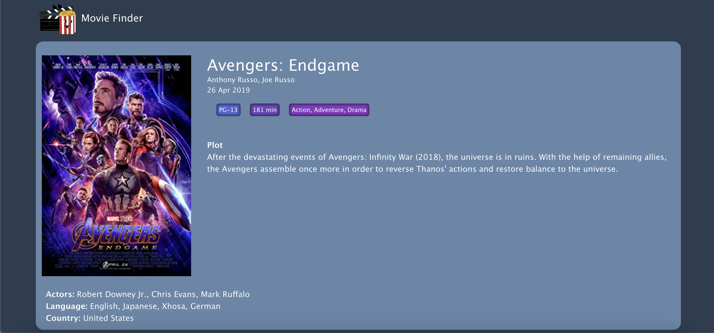

# Movie Finder 🎬 🍿
Movie Finder is a React app that uses the OMDB API to display different movies and their main information such as title, plot, genre, released date, runtime, etc.

Visit the app at: https://moviefinder-vianey.netlify.app

## Technologies used 💻
- HTML
- CSS
- JavaScript
- React

## Author 👤
- [VianeyAileen](https://github.com/VianeyAileen)